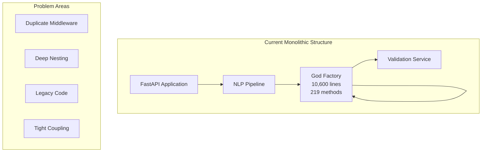
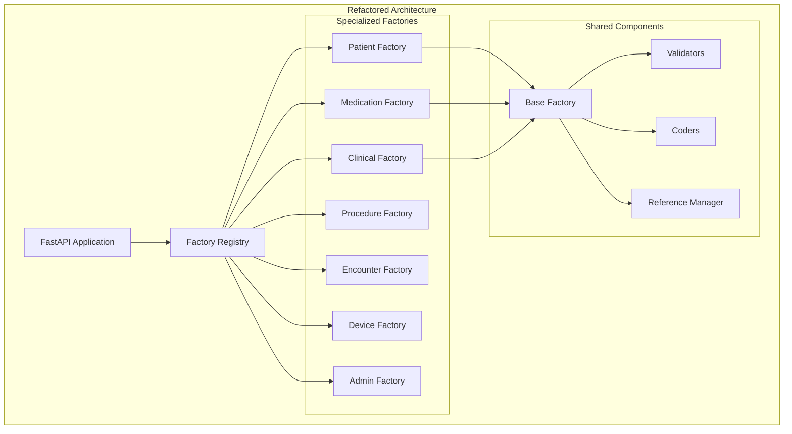

# NL-FHIR Refactoring Architecture Document
**Version:** 1.0.0
**Date:** September 25, 2025
**Architect:** Winston
**Status:** Draft

## Executive Summary

This architecture document outlines the technical approach for refactoring the NL-FHIR v1.1.0 codebase to address critical technical debt, particularly the 10,600-line FHIRResourceFactory God class. The refactoring maintains backward compatibility while introducing a modular, maintainable architecture that supports future growth.

## Current State Architecture

### System Overview


### Critical Issues

#### 1. FHIRResourceFactory God Class
- **File:** `src/nl_fhir/services/fhir/resource_factory.py`
- **Size:** 10,600 lines, 219 methods
- **Responsibilities:** ALL resource creation, validation, coding, references
- **Coupling:** Tightly coupled to every FHIR resource type
- **Testing:** Impossible to unit test individual components

#### 2. Middleware Duplication
```
/middleware/              # Original implementation
├── security.py
├── rate_limit.py
└── __init__.py

/api/middleware/         # Duplicate implementation
├── security.py          # Different logic!
├── rate_limit.py        # Inconsistent limits!
├── timing.py
└── sanitization.py
```

## Target State Architecture

### Modular Factory Pattern


### Component Architecture

#### Factory Registry Pattern
```python
# services/fhir/factories/__init__.py
class FactoryRegistry:
    """Central registry managing all FHIR resource factories"""

    def __init__(self):
        self._factories: Dict[str, BaseResourceFactory] = {}
        self._lazy_load = True
        self._initialize_factories()

    def get_factory(self, resource_type: str) -> BaseResourceFactory:
        """Get appropriate factory with lazy loading"""
        if resource_type not in self._factories:
            self._load_factory(resource_type)
        return self._factories[resource_type]

    @lru_cache(maxsize=None)
    def _get_factory_for_type(self, resource_type: str) -> Type[BaseResourceFactory]:
        """Map resource type to factory class"""
        mapping = {
            'Patient': PatientResourceFactory,
            'MedicationRequest': MedicationResourceFactory,
            'Observation': ClinicalResourceFactory,
            # ... more mappings
        }
        return mapping.get(resource_type, BaseResourceFactory)
```

#### Base Factory Abstract Class
```python
# services/fhir/factories/base.py
from abc import ABC, abstractmethod
from typing import Dict, Any, Optional
from fhir.resources.resource import Resource

class BaseResourceFactory(ABC):
    """Abstract base class for all FHIR resource factories"""

    def __init__(self, validators: ValidatorRegistry,
                 coders: CoderRegistry,
                 reference_manager: ReferenceManager):
        self.validators = validators
        self.coders = coders
        self.reference_manager = reference_manager

    @abstractmethod
    def create(self, data: Dict[str, Any]) -> Resource:
        """Create FHIR resource from extracted data"""
        pass

    @abstractmethod
    def validate(self, resource: Resource) -> bool:
        """Validate resource against FHIR spec"""
        pass

    def add_coding(self, resource: Resource, system: str, code: str):
        """Add standardized coding to resource"""
        return self.coders.add_coding(resource, system, code)

    def create_reference(self, resource: Resource) -> str:
        """Create FHIR reference for resource"""
        return self.reference_manager.create_reference(resource)
```

#### Specialized Factory Example
```python
# services/fhir/factories/medication_factory.py
class MedicationResourceFactory(BaseResourceFactory):
    """Factory for medication-related FHIR resources"""

    def create(self, data: Dict[str, Any]) -> Resource:
        """Create medication resource with safety checks"""
        resource_type = data.get('resource_type')

        if resource_type == 'MedicationRequest':
            return self._create_medication_request(data)
        elif resource_type == 'MedicationAdministration':
            return self._create_medication_administration(data)
        elif resource_type == 'MedicationStatement':
            return self._create_medication_statement(data)
        else:
            raise ValueError(f"Unknown medication resource type: {resource_type}")

    def _create_medication_request(self, data: Dict[str, Any]) -> MedicationRequest:
        """Create MedicationRequest with dosage validation"""
        request = MedicationRequest()

        # Medication coding
        request.medicationCodeableConcept = self._create_medication_concept(
            data.get('medication')
        )

        # Dosage with safety validation
        request.dosageInstruction = self._create_dosage_instructions(
            data.get('dosage')
        )

        # Apply safety checks
        self._validate_drug_interactions(request)
        self._validate_dosage_limits(request)

        return request
```

## Migration Strategy

### Phase 1: Foundation (Week 1-2)

#### 1.1 Create Core Infrastructure
```python
# New directory structure
services/fhir/
├── factories/
│   ├── __init__.py         # FactoryRegistry
│   ├── base.py             # BaseResourceFactory
│   └── tests/
│       └── test_base.py    # 100% coverage required
├── shared/
│   ├── validators.py       # Extracted validators
│   ├── coders.py          # Coding systems
│   └── references.py       # Reference management
```

#### 1.2 Parallel Implementation Pattern
```python
# Temporary adapter for backward compatibility
class FHIRResourceFactory:
    """Legacy interface maintained during migration"""

    def __init__(self):
        self.registry = FactoryRegistry()
        self._legacy_mode = feature_flags.is_enabled('use_legacy_factory')

    def create_resource(self, resource_type: str, data: Dict) -> Resource:
        if self._legacy_mode:
            return self._legacy_create_resource(resource_type, data)
        else:
            factory = self.registry.get_factory(resource_type)
            return factory.create(data)
```

### Phase 2: Incremental Migration (Week 3-5)

#### Migration Order (by risk and usage):
1. **Patient Resources** (highest usage, well-defined)
2. **Medication Resources** (complex logic, high risk)
3. **Clinical Resources** (performance critical)
4. **Administrative Resources** (low risk)
5. **Device Resources** (newest, cleanest)
6. **Remaining Resources** (lowest usage)

#### Feature Flag Strategy
```python
# config.py
FEATURE_FLAGS = {
    'use_new_patient_factory': True,      # Phase 2.1
    'use_new_medication_factory': False,  # Phase 2.2
    'use_new_clinical_factory': False,    # Phase 2.3
    'use_legacy_factory': False,          # Final cutover
}
```

### Phase 3: Middleware Consolidation (Week 6)

#### Unified Middleware Architecture
```python
# api/middleware/__init__.py
from .security import SecurityMiddleware
from .rate_limit import RateLimitMiddleware
from .timing import TimingMiddleware
from .sanitization import SanitizationMiddleware

def setup_middleware(app: FastAPI):
    """Single source of truth for middleware configuration"""
    app.add_middleware(SecurityMiddleware)
    app.add_middleware(RateLimitMiddleware,
                      default_limit="100/minute",
                      burst_limit="10/second")
    app.add_middleware(TimingMiddleware)
    app.add_middleware(SanitizationMiddleware)
```

### Phase 4: Code Organization (Week 7)

#### Simplified Directory Structure
```
services/
├── nlp/
│   ├── extractors/      # Flattened from 5 levels
│   ├── processors/      # Consolidated LLM logic
│   └── models.py        # Unified model definitions
├── fhir/
│   ├── factories/       # New modular factories
│   ├── shared/          # Common components
│   └── validators/      # Centralized validation
└── safety/              # Unchanged
```

## Performance Considerations

### Optimization Strategies

#### 1. Lazy Loading
```python
class FactoryRegistry:
    """Lazy load factories only when needed"""

    def _load_factory(self, resource_type: str):
        if resource_type not in self._factories:
            factory_class = self._get_factory_for_type(resource_type)
            self._factories[resource_type] = factory_class(
                self.validators,
                self.coders,
                self.reference_manager
            )
```

#### 2. Caching Strategy
```python
@lru_cache(maxsize=128)
def get_coding_system(system: str) -> CodingSystem:
    """Cache frequently used coding systems"""
    return CodingSystemRegistry.get(system)
```

#### 3. Resource Pooling
```python
class ResourcePool:
    """Pool FHIR resource instances for reuse"""

    def __init__(self, resource_class: Type[Resource], size: int = 100):
        self._pool = Queue(maxsize=size)
        self._resource_class = resource_class

    def acquire(self) -> Resource:
        try:
            return self._pool.get_nowait()
        except Empty:
            return self._resource_class()

    def release(self, resource: Resource):
        resource.clear()  # Reset resource state
        try:
            self._pool.put_nowait(resource)
        except Full:
            pass  # Let GC handle it
```

### Performance Benchmarks

| Metric | Current | Target | Measurement |
|--------|---------|--------|-------------|
| Resource creation | 15ms | <10ms | p95 latency |
| Bundle assembly | 200ms | <150ms | p95 latency |
| Memory per request | 50MB | <30MB | Peak usage |
| Factory initialization | N/A | <5ms | Cold start |

## Security Architecture

### Defense in Depth
```python
class SecureResourceFactory(BaseResourceFactory):
    """Security-enhanced base factory"""

    def create(self, data: Dict[str, Any]) -> Resource:
        # Input sanitization
        data = self.sanitizer.clean(data)

        # PHI audit logging (no actual PHI)
        self.audit_logger.log_access(
            request_id=get_request_id(),
            resource_type=data.get('resource_type'),
            action='CREATE'
        )

        # Create resource
        resource = self._create_internal(data)

        # Output validation
        if not self.validator.validate_output(resource):
            raise SecurityError("Resource failed output validation")

        return resource
```

## Testing Strategy

### Test Coverage Requirements

#### Unit Tests (Target: 100%)
```python
# factories/tests/test_medication_factory.py
class TestMedicationFactory:
    def test_create_medication_request(self):
        """Test basic medication request creation"""

    def test_dosage_validation(self):
        """Test dosage safety limits"""

    def test_drug_interaction_check(self):
        """Test interaction validation"""

    def test_reference_creation(self):
        """Test reference generation"""
```

#### Integration Tests
```python
# tests/integration/test_factory_registry.py
def test_factory_registry_full_workflow():
    """Test complete resource creation workflow"""
    registry = FactoryRegistry()

    # Create patient
    patient_factory = registry.get_factory('Patient')
    patient = patient_factory.create(patient_data)

    # Create medication referencing patient
    med_factory = registry.get_factory('MedicationRequest')
    medication = med_factory.create({
        **medication_data,
        'patient_reference': patient.id
    })

    assert medication.subject.reference == f"Patient/{patient.id}"
```

### Performance Testing
```python
@pytest.mark.benchmark
def test_factory_performance(benchmark):
    """Benchmark factory performance"""
    registry = FactoryRegistry()
    factory = registry.get_factory('Observation')

    result = benchmark(factory.create, observation_data)
    assert result.id is not None
    assert benchmark.stats['mean'] < 0.010  # <10ms average
```

## Rollback Strategy

### Feature Flag Rollback
```python
# Emergency rollback procedure
def emergency_rollback():
    """Immediate rollback to legacy factory"""
    feature_flags.set('use_legacy_factory', True)
    feature_flags.set('use_new_patient_factory', False)
    feature_flags.set('use_new_medication_factory', False)
    # ... disable all new factories

    # Clear factory cache
    FactoryRegistry._instances.clear()

    # Restart application
    restart_application()
```

### Database Rollback Points
- Pre-migration database backup
- Post-Phase-1 checkpoint
- Post-Phase-2 checkpoint
- Pre-production checkpoint

## Monitoring & Observability

### Key Metrics
```python
# Prometheus metrics
factory_creation_time = Histogram(
    'fhir_factory_creation_seconds',
    'Time to create FHIR resource',
    ['resource_type', 'factory_type']
)

factory_errors = Counter(
    'fhir_factory_errors_total',
    'Total factory errors',
    ['resource_type', 'error_type']
)
```

### Dashboards
- Factory performance by type
- Error rates by resource type
- Memory usage trends
- Response time distribution

## Documentation Requirements

### Developer Documentation
1. Factory pattern guide
2. Migration playbook
3. API changes guide
4. Testing requirements

### Architectural Decision Records (ADRs)
1. ADR-001: Factory Pattern Selection
2. ADR-002: Migration Strategy
3. ADR-003: Performance Optimization Approach
4. ADR-004: Security Architecture

## Risk Matrix

| Risk | Probability | Impact | Mitigation |
|------|------------|--------|------------|
| Production breakage | Medium | High | Feature flags, gradual rollout |
| Performance degradation | Low | High | Benchmark gates, monitoring |
| Team resistance | Low | Medium | Training, documentation |
| Incomplete migration | Medium | Medium | Phased approach, checkpoints |

## Success Criteria

### Technical Metrics
- [ ] No single file >500 lines
- [ ] Cyclomatic complexity <50 per class
- [ ] Test coverage >80%
- [ ] Performance maintained or improved
- [ ] Zero production incidents

### Business Metrics
- [ ] 50% reduction in resource implementation time
- [ ] 40% reduction in bug rate
- [ ] 30% improvement in developer velocity
- [ ] Team satisfaction score >8/10

## Appendices

### A. Factory Method Mapping
[Detailed mapping of 219 methods to new factories]

### B. Performance Benchmarks
[Baseline performance metrics]

### C. Security Audit Results
[Current security posture assessment]

---
**Document Version:** 1.0.0
**Last Updated:** September 25, 2025
**Next Review:** October 2, 2025