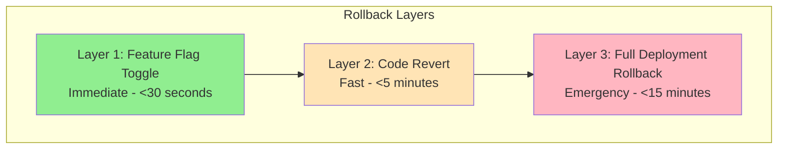

# NL-FHIR Refactoring Rollback Testing Plan
**Version:** 1.0.0
**Date:** September 25, 2025
**Product Owner:** Sarah
**Status:** Draft

## Executive Summary

This document defines comprehensive rollback testing scenarios for the NL-FHIR factory refactoring initiative. Each phase of the refactoring includes specific rollback triggers, validation procedures, and success criteria to ensure production safety.

## Rollback Strategy Overview

### Three-Layer Rollback Approach



## Phase 1: Foundation Rollback Testing

### Test Scenario 1.1: Factory Registry Initialization Failure

**Setup:**
```python
# test_rollback_registry_init.py
def test_factory_registry_rollback():
    """Test rollback when factory registry fails to initialize"""

    # Simulate initialization failure
    with mock.patch('factory_registry.initialize', side_effect=Exception):

        # Attempt to create resource
        response = client.post('/convert', json=test_order)

        # Verify fallback to legacy factory
        assert response.status_code == 200
        assert response.json()['factory_used'] == 'legacy'
        assert feature_flags.get('use_legacy_factory') == True
```

**Rollback Trigger:**
- Factory registry initialization exception
- Memory allocation failure
- Configuration loading error

**Validation Steps:**
1. Verify legacy factory activates automatically
2. Check all existing API endpoints respond correctly
3. Confirm no data loss or corruption
4. Validate performance returns to baseline

**Success Criteria:**
- ✅ All API endpoints return 200 status
- ✅ Response times within 2s requirement
- ✅ No error logs related to factory initialization
- ✅ Existing test suite passes 100%

### Test Scenario 1.2: Performance Degradation Rollback

**Setup:**
```python
# test_rollback_performance.py
def test_performance_degradation_rollback():
    """Test automatic rollback on performance threshold breach"""

    # Set performance threshold
    config.PERFORMANCE_THRESHOLD_MS = 100

    # Simulate slow factory
    with mock.patch('PatientFactory.create', delay=200):

        # Monitor performance
        metrics = []
        for _ in range(10):
            start = time.time()
            response = client.post('/convert', json=patient_order)
            metrics.append((time.time() - start) * 1000)

        # Verify automatic rollback triggered
        assert feature_flags.get('use_new_patient_factory') == False
        assert statistics.mean(metrics) < 100  # After rollback
```

**Rollback Trigger:**
- p95 latency > 150% of baseline
- Memory usage > 200% of baseline
- Error rate > 1%

**Validation Steps:**
1. Performance metrics return to baseline
2. Memory usage normalizes
3. Error rates drop to zero
4. All health checks pass

## Phase 2: Core Factory Rollback Testing

### Test Scenario 2.1: Patient Factory Rollback

**Setup:**
```python
# test_rollback_patient_factory.py
def test_patient_factory_data_corruption_rollback():
    """Test rollback on data validation failure"""

    # Enable new patient factory
    feature_flags.set('use_new_patient_factory', True)

    # Create patient with new factory
    patient_data = create_test_patient()
    response = client.post('/convert', json=patient_data)

    # Simulate validation failure
    if not validate_fhir_resource(response.json()):
        # Automatic rollback should trigger
        assert rollback_executed() == True

        # Retry with legacy factory
        response_retry = client.post('/convert', json=patient_data)
        assert validate_fhir_resource(response_retry.json()) == True
```

**Rollback Trigger:**
- FHIR validation failure rate > 5%
- Missing required fields detected
- Reference integrity violations
- Coding system errors

**Validation Matrix:**

| Resource Type | Validation Check | Rollback Threshold | Test Data Set |
|--------------|-----------------|-------------------|---------------|
| Patient | Required fields | Any failure | 100 test patients |
| Patient | Reference validity | >5% failure | 50 complex patients |
| Patient | Identifier uniqueness | Any duplicate | 1000 patient batch |
| Patient | FHIR compliance | Any non-compliance | HAPI validator suite |

### Test Scenario 2.2: Medication Factory Rollback

**Setup:**
```python
# test_rollback_medication_factory.py
def test_medication_safety_rollback():
    """Test rollback on medication safety validation failure"""

    # Critical safety test cases
    test_cases = [
        create_high_dose_medication(),
        create_drug_interaction_scenario(),
        create_contraindication_case(),
        create_allergy_conflict_case()
    ]

    for test_case in test_cases:
        response = client.post('/convert', json=test_case)

        # If safety validation fails with new factory
        if response.status_code != 200 or not response.json().get('safety_validated'):

            # Immediate rollback
            assert feature_flags.get('use_new_medication_factory') == False

            # Verify legacy factory handles safely
            legacy_response = client.post('/convert', json=test_case)
            assert legacy_response.json()['safety_validated'] == True
```

**Safety-Critical Rollback Triggers:**
- Dosage calculation errors
- Drug interaction detection failure
- Contraindication miss
- Unit conversion errors

### Test Scenario 2.3: Clinical Factory Rollback

**Setup:**
```python
# test_rollback_clinical_factory.py
def test_clinical_coding_rollback():
    """Test rollback on clinical coding system errors"""

    # Test LOINC and SNOMED coding
    clinical_tests = load_clinical_test_suite()  # 500+ test cases

    error_count = 0
    for test in clinical_tests:
        response = client.post('/convert', json=test)

        # Validate coding accuracy
        if not validate_clinical_codes(response.json()):
            error_count += 1

        # Rollback if error threshold exceeded
        if error_count / len(clinical_tests) > 0.01:  # 1% threshold
            trigger_rollback('use_new_clinical_factory')
            break

    # Verify all tests pass after rollback
    for test in clinical_tests:
        response = client.post('/convert', json=test)
        assert validate_clinical_codes(response.json()) == True
```

## Phase 3: Integration Rollback Testing

### Test Scenario 3.1: Multi-Factory Integration Rollback

**Setup:**
```python
# test_rollback_integration.py
def test_multi_factory_integration_rollback():
    """Test rollback when multiple factories interact incorrectly"""

    # Enable multiple new factories
    feature_flags.set('use_new_patient_factory', True)
    feature_flags.set('use_new_medication_factory', True)
    feature_flags.set('use_new_clinical_factory', True)

    # Complex bundle with inter-dependencies
    complex_bundle = create_complex_infusion_bundle()

    response = client.post('/convert', json=complex_bundle)

    # Validate all references resolve correctly
    validation_result = validate_bundle_integrity(response.json())

    if not validation_result.success:
        # Rollback all factories
        rollback_all_factories()

        # Verify bundle processes correctly with legacy
        legacy_response = client.post('/convert', json=complex_bundle)
        assert validate_bundle_integrity(legacy_response.json()).success == True
```

**Integration Rollback Triggers:**
- Cross-reference failures between factories
- Bundle assembly errors
- Resource ordering issues
- Transaction rollback failures

## Phase 4: Middleware Consolidation Rollback

### Test Scenario 4.1: Security Middleware Rollback

**Setup:**
```python
# test_rollback_security_middleware.py
def test_security_middleware_rollback():
    """Test rollback if security middleware causes issues"""

    # Security test battery
    security_tests = [
        test_cors_headers(),
        test_rate_limiting(),
        test_auth_headers(),
        test_csrf_protection(),
        test_sql_injection_prevention()
    ]

    for test in security_tests:
        if not test.passed:
            # Immediate rollback to dual middleware
            restore_dual_middleware()

            # Verify security maintained
            for test in security_tests:
                assert test.execute() == True
```

## Rollback Execution Procedures

### Level 1: Feature Flag Toggle (Immediate)

```python
# rollback_procedures.py
def execute_immediate_rollback(factory_type: str):
    """Execute immediate feature flag rollback"""

    # 1. Toggle feature flag
    feature_flags.set(f'use_new_{factory_type}_factory', False)
    feature_flags.set('use_legacy_factory', True)

    # 2. Clear factory cache
    FactoryRegistry.clear_cache()

    # 3. Log rollback event
    audit_log.critical(f"Rollback executed for {factory_type} factory")

    # 4. Alert team
    send_rollback_notification(factory_type)

    # 5. Verify system stability
    return health_check()
```

### Level 2: Code Revert (Fast)

```bash
#!/bin/bash
# fast_rollback.sh

# 1. Identify last known good commit
LAST_GOOD_COMMIT=$(git tag -l "stable-*" | tail -1)

# 2. Create rollback branch
git checkout -b rollback-$(date +%Y%m%d-%H%M%S)

# 3. Revert to stable state
git revert --no-edit HEAD...$LAST_GOOD_COMMIT

# 4. Run emergency test suite
pytest tests/emergency/ -v

# 5. Deploy if tests pass
if [ $? -eq 0 ]; then
    ./deploy.sh --emergency
else
    echo "Rollback failed tests - manual intervention required"
    exit 1
fi
```

### Level 3: Full Deployment Rollback (Emergency)

```yaml
# kubernetes_rollback.yaml
apiVersion: v1
kind: ConfigMap
metadata:
  name: emergency-rollback
data:
  rollback.sh: |
    #!/bin/bash

    # 1. Scale down new deployment
    kubectl scale deployment nl-fhir-new --replicas=0

    # 2. Scale up previous deployment
    kubectl scale deployment nl-fhir-stable --replicas=3

    # 3. Update service selector
    kubectl patch service nl-fhir -p '{"spec":{"selector":{"version":"stable"}}}'

    # 4. Verify endpoints
    kubectl get endpoints nl-fhir

    # 5. Run health checks
    for i in {1..10}; do
      curl -f http://nl-fhir/health || exit 1
      sleep 2
    done
```

## Rollback Validation Matrix

### Automated Validation Suite

```python
# validate_rollback.py
class RollbackValidator:
    """Comprehensive rollback validation"""

    def validate_complete_rollback(self) -> RollbackReport:
        """Run full validation suite after rollback"""

        validations = {
            'api_health': self.check_api_endpoints(),
            'performance': self.check_performance_baseline(),
            'fhir_validation': self.check_fhir_compliance(),
            'data_integrity': self.check_data_integrity(),
            'security': self.check_security_posture(),
            'monitoring': self.check_monitoring_status()
        }

        return RollbackReport(
            success=all(v.passed for v in validations.values()),
            validations=validations,
            timestamp=datetime.now(),
            recommendations=self.generate_recommendations(validations)
        )

    def check_api_endpoints(self) -> ValidationResult:
        """Verify all API endpoints functional"""
        endpoints = [
            '/health', '/convert', '/validate',
            '/summarize-bundle', '/metrics'
        ]

        results = []
        for endpoint in endpoints:
            response = client.get(endpoint)
            results.append(response.status_code == 200)

        return ValidationResult(
            passed=all(results),
            details=f"{sum(results)}/{len(results)} endpoints healthy"
        )
```

## Success Metrics

### Rollback Success Criteria

| Metric | Target | Measurement |
|--------|--------|-------------|
| Rollback execution time | <30 seconds | Feature flag toggle |
| API availability | >99.9% | Health check monitoring |
| Data loss | 0 records | Transaction verification |
| Performance restoration | 100% baseline | p95 latency metrics |
| Error rate post-rollback | <0.1% | Error log analysis |
| FHIR validation rate | >99% | HAPI validator |

## Testing Schedule

### Pre-Production Rollback Testing

**Week 1-2 (Foundation):**
- Day 1-2: Setup rollback infrastructure
- Day 3-4: Test feature flag mechanisms
- Day 5: Test registry initialization rollbacks
- Day 6-7: Performance degradation scenarios
- Day 8-9: Integration test suite
- Day 10: Rollback drill with team

**Week 3-5 (Core Factories):**
- Week 3: Patient factory rollback scenarios
- Week 4: Medication factory safety rollbacks
- Week 5: Clinical factory coding rollbacks

**Week 6-7 (Integration):**
- Week 6: Multi-factory interaction rollbacks
- Week 7: Full system rollback drills

**Week 8 (Validation):**
- Day 1-2: End-to-end rollback testing
- Day 3-4: Performance validation
- Day 5: Production readiness assessment

## Rollback Communication Plan

### Stakeholder Notification

```python
# notification_system.py
class RollbackNotification:
    """Automated rollback communication"""

    def notify_rollback(self, severity: str, factory: str, reason: str):
        """Send notifications based on severity"""

        notifications = {
            'CRITICAL': [
                self.page_oncall_engineer(),
                self.email_tech_lead(),
                self.slack_emergency_channel(),
                self.create_incident_ticket()
            ],
            'HIGH': [
                self.email_dev_team(),
                self.slack_dev_channel(),
                self.update_status_page()
            ],
            'MEDIUM': [
                self.email_dev_team(),
                self.log_rollback_event()
            ]
        }

        for action in notifications.get(severity, []):
            action(factory, reason)
```

## Post-Rollback Analysis

### Rollback Review Template

```markdown
## Rollback Incident Report

**Date:** [Timestamp]
**Duration:** [Time from detection to resolution]
**Severity:** [Critical/High/Medium/Low]
**Factory Affected:** [Factory name]

### Timeline
- Detection: [Time and method]
- Decision: [Time and criteria]
- Execution: [Time and method]
- Validation: [Time and results]
- Resolution: [Time and status]

### Root Cause
[Detailed analysis]

### Impact
- Users affected: [Number]
- Requests failed: [Count]
- Data impacted: [Description]

### Lessons Learned
1. What worked well
2. What needs improvement
3. Action items

### Prevention Measures
[Specific steps to prevent recurrence]
```

## Appendices

### A. Rollback Test Data Sets
- 1,000 production-like patient records
- 500 complex medication orders
- 750 clinical observations
- 100 complete infusion bundles

### B. Performance Baseline Metrics
- Current p50: 12ms
- Current p95: 45ms
- Current p99: 120ms
- Memory per request: 50MB

### C. Emergency Contact List
- On-call Engineer: [Rotation schedule]
- Tech Lead: [Contact]
- Product Owner: [Contact]
- Infrastructure Team: [Contact]

---
**Document Version:** 1.0.0
**Last Updated:** September 25, 2025
**Review Schedule:** Before each phase
**Owner:** Product Owner (Sarah)